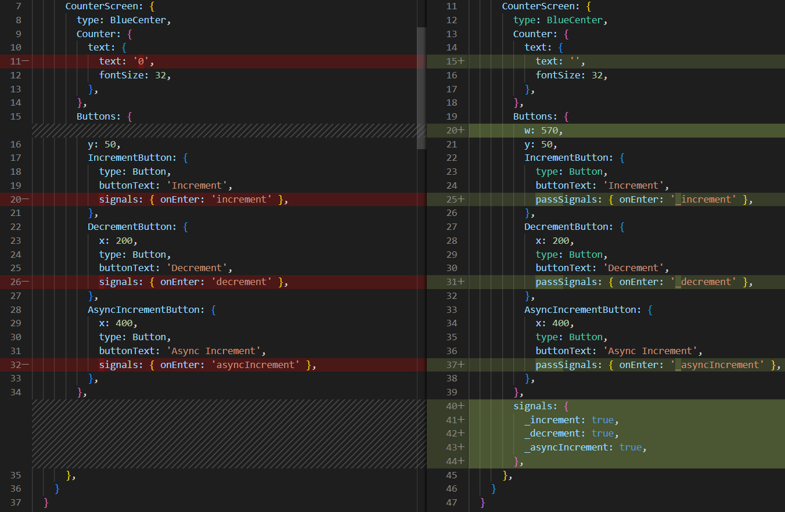

# Redux ToolKit setup for LightningJS application
> RTK simplifies your code _and_ eliminates many common Redux mistakes and bugs! [Official docs](https://redux-toolkit.js.org)

For more info about RTK read [Why Redux Toolkit is How To Use Redux Today](https://redux.js.org/introduction/why-rtk-is-redux-today).

Let's look at how to set up a basic store for the LightningJS app with Redux Toolkit (RTK). For example, we'll create a trivial counter app.

Firstly add the Redux Toolkit package to your project `npm install @reduxjs/toolkit` and download Redux DevTools for Chrome [here](https://chrome.google.com/webstore/detail/redux-devtools/lmhkpmbekcpmknklioeibfkpmmfibljd).

#### Configure our store
Create a file named `src/logic/store.js`. Import the `configureStore` API from Redux Toolkit. Read more about store configuration [on the official docs](https://redux-toolkit.js.org/api/configureStore).
```javascript
import { configureStore } from '@reduxjs/toolkit'
import counter from './counter/counter.slice'

export const store = configureStore({
  reducer: {
    counter,
  },
})
```

#### Slice creation
Redux slice it's a common Redux reducer with build-in common use-cases implementation out of the box.
> **Note:** reducer functions may "mutate" the state using Immer under the hood.

#### For slice creation follow the next flow:
1. In the `logic` folder create relevant slice folder. It's `logic/counter` in our case;
2. Use the next pattern for a slice file naming and content
	- `sliceName.slice.js` for main logic
	- `sliceName.constants.js` for constants
	- `sliceName.selector.js` for getting state data
	- `sliceName.thunk.js` for asyn actions
	- `README.md` for description (optional)

Counter slice files have next content:
```javascript
// src/logic/counter.constants.js

export const name = 'counter'
```
```javascript
// src/logic/counter.selector.js

export const getCounterValue = state => state.counter.value
```
```javascript
// src/logic/counter.slice.js

import { createSlice } from '@reduxjs/toolkit'

const counterSlice = createSlice({
  name: 'counter',
  initialState: {
	value: 0
  },
  reducers: {
    increment(state) {
      state.value++
    },
    decrement(state) {
      state.value--
    },
    incrementByAmount(state, action) {
      state.value += action.payload
    },
  },
})

export const { increment, decrement } = counterSlice.actions
export default counterSlice.reducer

export const asyncIncrement = () => async dispatch => {
  const value = await new Promise((resolve, reject) => {
    setTimeout(() => {
      resolve(5)
    }, 1000)
  })

  dispatch(counterSlice.actions.incrementByAmount(value))
}
```
> **Note:** A function that accepts an initial state, an object of reducer functions, and a "slice name", and automatically generates action creators and action types that correspond to the reducers and state. This API is the standard approach for writing Redux logic.
```javascript
// src/logic/counter.thunk.js

import { createAsyncThunk } from '@reduxjs/toolkit'
import { name } from './counter.constants'
import { incrementByAmount } from './counter.slice'

export const asyncIncrement = createAsyncThunk(
  `${name}/asyncIncrement`,
  async (_, { dispatch }) => {
    const value = await new Promise((resolve, reject) => {
      setTimeout(() => {
        resolve(5)
      }, 1000)
    })

    await dispatch(incrementByAmount(value))
  }
)
```
More about asynchronous logic and data fetching with RTK read [here](https://redux-toolkit.js.org/usage/usage-guide#asynchronous-logic-and-data-fetching).

# Using Redux on Lightning component
> **Warning:** it's not production-ready implementation, just for example. We add more realistic logic in the `rtk/advanced-setup` branch.

In the `router/setup` branch we've added the `CounterScreen` with a necessary template for current logic. **Important tip & trick:** we should update our template with [pass signals](https://rdkcentral.github.io/Lightning/docs/components/communication/signal#pass-signals) to pass over a signal to the parent otherwise we cannot reach the handler method.



### Let's expand it with Redux
Firstly, we should `import store from './logic/store'`.
Secondly, we subscribe our component for store update and call the initial dispatch on the `_init` hook. Whenever the state will update - our subscribed component gets the necessary value and update it on the template.
```javascript
  _init() {
    this.focusIndex = 0

    store.subscribe(() => {     
	  const state = store.getState()
      this.tag('CounterScreen.Counter').text.text = getCounterValue(state)
    })

    store.dispatch({ type: '__INIT__' })
  }
```
Thirdly, add the handler methods for our buttons signals and dispatch appropriate action which should be imported above.
```javascript
  _increment() {
    store.dispatch(increment())
  }

  _decrement() {
    store.dispatch(decrement())
  }

  _asyncIncrement() {
    store.dispatch(asyncIncrement())
  }
```

Nice! We've made friends Redux with Lightning component.
